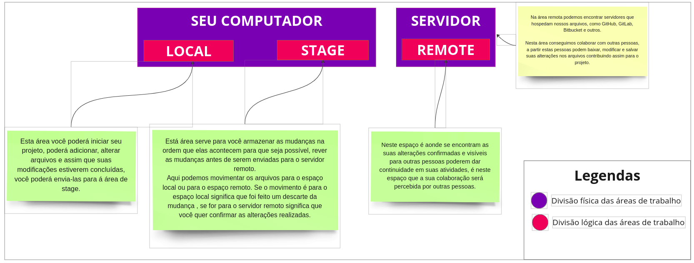

# 10 Comandos Git mais utilizados no desenvolvimento de software

Antes de falarmos dos comandos em si, é importante entendermos um conceito fundamental desta ferramenta. Vou abastrair e chamar este conceito de espaços de trabalhos.

Sabemos que o git foi construiddo para que possamos ter controle das alterações realizadas em arquivos, ou seja ele é um sistema de controle de versão.

Para que este controle seja efetuado de maneira eficiente os idealizadores criaram 3 espaços de trabalhos aonde podemos executar comandos para uma deles.

A imagem abaixo da uma visão geral sobre cada um destes espaços.

Veja que estes espaços de trabalhos são organizações lógicas feitas para estarem fisicamente em seu computador e um computador remoto, também conhecido como servidor.

Neste artigo, exploraremos os 10 comandos mais utilizados na prática de desenvolvimento de software com Git, utilizando esta abstração de espaços de trabalho premissa. 

## 1 - git init

O primeiro passo ao iniciar um novo projeto é inicializar um repositório Git. O comando git init é utilizado para criar um novo repositório Git em um diretório existente. Isso marca o início do rastreamento de alterações no projeto.
Este comando é executado em seu espaço **LOCAL em seu computador**

Em um diretório de sua escolha digite o camando abaixo.

`git init`

## 2. git clone

Este comando movimenta os arquivos do espaço remoto no servidor para o seu espaço local em seu computador.

Quando você deseja criar uma cópia local de um repositório remoto, utiliza-se o comando git clone. Isso é fundamental ao colaborar em projetos existentes ou ao iniciar um novo projeto com base em um repositório remoto.
 

`git clone <URL do repositório>`

## 3. git add

Este comando é utilizado em seu espaço de trabalho local em seu computador.

Antes de confirmar as alterações, é necessário adicionar os arquivos desejados ao "índice" do Git. O comando git add faz isso, preparando os arquivos para serem incluídos no próximo commit.

`git add <nome-do-arquivo>`

## 4. git commit

Este comando movimenta o arquivo de seu espaço **LOCAL** para o epaço de **STAGE** em seu computador. 

O comando git commit confirma as alterações adicionadas ao índice. Cada commit possui uma mensagem que descreve as alterações realizadas. Escrever mensagens de commit claras e concisas é uma prática recomendada.

 `git commit -m "Mensagem descritiva do commit"`

## 5. git pull

Este comando movimenta as mudanças do epaço **REMOTO** no servidor para seu espaço **LOCAL** em sua máquina.

Quando trabalhamos em um projeto com outras pessoas, é crucial manter nosso repositório local atualizado. O comando git pull baixa as alterações mais recentes do repositório remoto e mescla-as automaticamente com a versão local.

`git pull origin <nome-do-branch>`

## 6. git push

Este comando movimento suas mudanças que estão em seu espaço de **STAGE** em seu computador para o espaço **REMOTO** no servidor.

Para compartilhar suas alterações com o repositório remoto, utiliza-se o comando git push. Isso envia os commits locais para o repositório remoto, permitindo que outros membros da equipe acessem as suas alterações.

git push origin <nome-do-branch>

## 7. git branch

O comando git branch é utilizado para listar, criar ou excluir branches (ramificações). Branches são úteis para desenvolver recursos isoladamente sem afetar o código principal.

git branch
git branch <nome-do-branch>

## 8. git merge

O comando git merge é utilizado para mesclar alterações de uma branch para outra. Por exemplo, ao concluir o desenvolvimento em uma branch de recurso, você pode mesclar suas alterações de volta à branch principal.

git merge <nome-do-branch>

## 9. git log

Para visualizar o histórico de commits, utiliza-se o comando git log. Isso fornece informações detalhadas sobre os commits, como autor, data e mensagem associada.

git log

## 10. git status

O comando git status fornece informações sobre o estado atual do repositório. Ele mostra os arquivos modificados, adicionados e outros estados relevantes.

Esses 10 comandos formam a base para a maioria das atividades diárias de um desenvolvedor utilizando Git. Ao compreender e utilizar efetivamente esses comandos, os desenvolvedores podem colaborar de maneira mais eficiente, rastrear alterações e manter o histórico do projeto de forma organizada. Dominar essas habilidades essenciais é fundamental para o sucesso no desenvolvimento de software moderno.